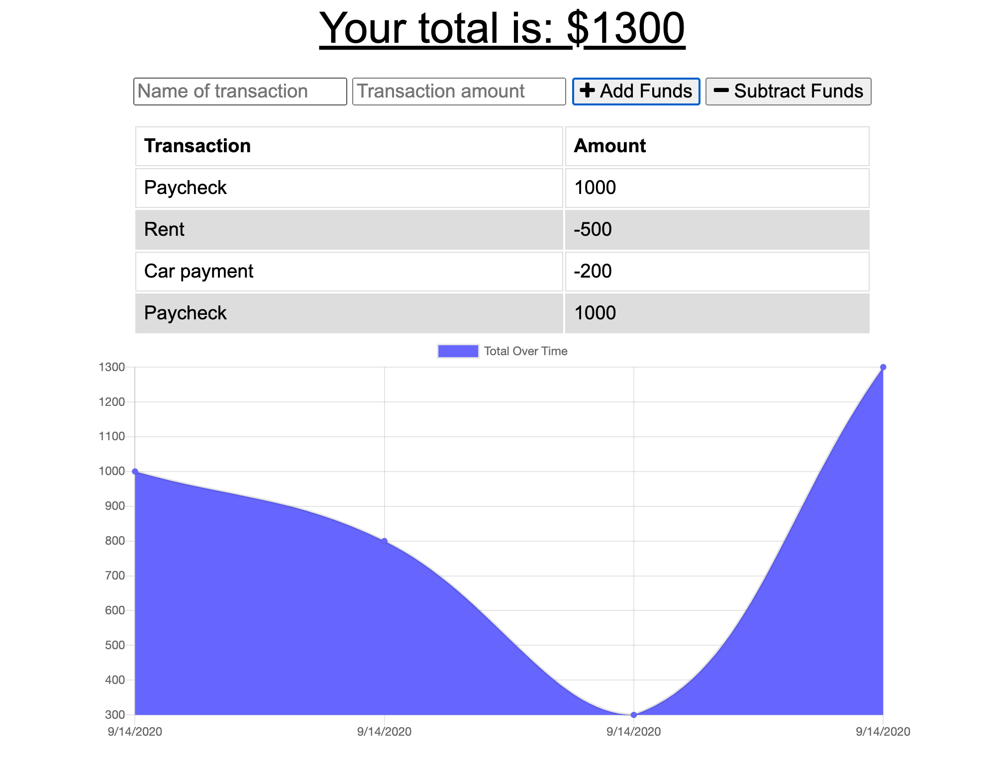
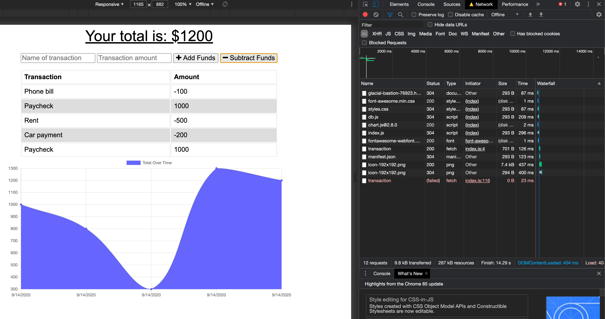

# Online-offline-budget-tracker

App deployed at: https://glacial-bastion-76923.herokuapp.com/

### Description:
>This application allows a user to log and track their expensives.  This is also a **progressive web application** and still mantains functionality if you are using it offline.  

## Technologies Used:
This full stack application uses, node.js and express to create the server.  We are using mongoDB and mongoose for our database.  We also use a manifest.json file, a service-worker, and an indexDB file to allow us to cache all our data and use the application offline.

## Usage:
To use this application, type in the name of the transaction, (i.e. rent, gas, food, paychecks etc) and the value of the transaction.  The select if the transaction is adding funds or using funds.  One you have loaded this page in your browser, you can use it offline.

